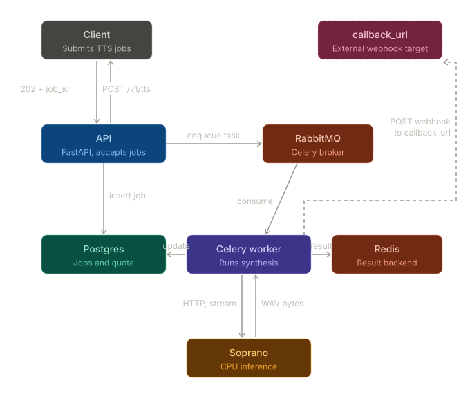

# MiniTTS

MiniTTS is a production-minded foundation for an asynchronous Text-to-Speech service based on the [Soprano-1.1-80M](https://huggingface.co/ekwek/Soprano-1.1-80M) model.

For inference, the service runs the Soprano model on CPU, served behind [Granian](https://github.com/emmett-framework/granian) as the Rust-based inference server.

## What This Project Aims To Accomplish

The target system is an async TTS microservice where clients:

1. Submit text with a callback URL.
2. Receive a job identifier immediately.
3. Have synthesis processed in the background.
4. Receive completion via webhook. (as a stream of bytes as soon as the data is available)

In parallel, the platform should track quota usage (for example by character count or estimated audio seconds) so each request contributes to measurable, auditable usage.

This architecture is designed for reliability and scale: API traffic remains responsive while long-running synthesis jobs are handled by workers and queue infrastructure.

## Architecture

The API accepts a TTS job, persists it to Postgres, and dispatches a Celery task through RabbitMQ. A worker consumes the task, calls the Soprano inference service, streams audio bytes back, updates the job row, stores the result in Redis (Celery's result backend), and posts a webhook to the client's callback URL.



Producer (API) and consumer (worker) are intentionally decoupled through the broker, hence, the API can accept and queue work even when no worker is currently running, and worker restarts do not affect API availability.

## How This Repository Intersects With The Task

Current codebase already provides the initial building blocks:

- FastAPI service scaffold in `api/app`.
- Health endpoint at `/health`.
- Environment-based configuration for Redis and Postgres.
- Docker Compose stack for Caddy, Redis, RedisInsight, RabbitMQ, Postgres, pgAdmin, the MiniTTS API container, and the Soprano inference engine + API.
- A developer-friendly landing page at `http://localhost:3000` that links to the main service subdomains.
- A Celery package scaffold (`celeryz/`) for async worker and task implementation.

This means the repository is already aligned with the requested stack direction (FastAPI + queue + database + Dockerized local development), and is ready for the remaining implementation work: job lifecycle endpoints, worker execution path, webhook delivery, and quota accounting logic.

## Quick Start

1. Ensure Docker is installed and runs locally.
2. From the project root, start the stack:

   ```bash
   docker compose up --build
   ```

3. Open the local gateway in your browser:

   ```text
   http://localhost:3000
   ```

   This serves a small index page that acts like a local control panel:

   - MiniTTS API: <http://api.localhost:3000>, the FastAPI app where request endpoints live and where TTS jobs will be accepted.
   - Soprano: <http://soprano-inference.localhost:3000>, the CPU inference API service that performs text-to-speech generation.
   - RedisInsight: <http://redisinsight.localhost:3000>, a Redis admin UI for inspecting cache/queue data and debugging queue state.
   - RabbitMQ: <http://rabbitmq.localhost:3000>, the broker UI for viewing message queues and worker traffic.
   - pgAdmin: <http://pgadmin.localhost:3000>, a database admin UI for browsing and managing Postgres.

4. Verify API health:

   ```bash
   curl http://api.localhost:3000/health
   curl http://soprano-inference.localhost:3000/health
   ```

   The health of the remaining services is handled by Docker and the corresponding images.

5. Stop all services:

   ```bash
   docker compose down
   ```

## Running Services

The current Compose stack starts these services:

- `caddy`: local reverse proxy and landing page at `localhost:3000`.
- `api`: the FastAPI application that will accept TTS requests and expose HTTP endpoints.
- `soprano`: the CPU inference service that turns text into audio.
- `redis`: the Redis instance used for queueing and other fast shared state.
- `redisinsight`: a Redis UI for inspecting keys, queues, and runtime state.
- `rabbitmq`: the RabbitMQ broker used for message delivery between producers and workers.
- `postgres`: the Postgres database for persistent application data.
- `pgadmin`: a Postgres UI for inspecting tables and managing the database.

Note: the repository currently contains Celery worker code under `celeryz/`, but the worker service is not yet added to the Compose file.

## Soprano Inference Service (CPU)

`soprano/` provides a dedicated inference microservice for the Soprano-1.1-80M model, exposing `/v1/audio/speech` and `/health` via a FastAPI + Granian stack. The API **streams audio chunks** in WAV format at 32kHz sample rate (which is the default for this model) to the client as they are generated, drastically reducing Time-To-First-Audio (TTFA).

### Latency-Focused Tooling And Optimizations

- Granian provides a low-latency, Rust-backed ASGI server for Python apps (benchmarks: <https://github.com/emmett-framework/granian/blob/master/benchmarks/vs.md>).
- `uvloop` is used as the event loop to reduce request overhead (benchmarks: <https://github.com/MagicStack/uvloop#performance>).
- Worker and thread counts are configurable via `WORKERS` and `THREADS` to tune concurrency.
- Optional model warm-up at startup (`WARMUP_ON_STARTUP=1`) runs an inference per worker on varied data out of `warmup_data/` to avoid first-request cold starts.
